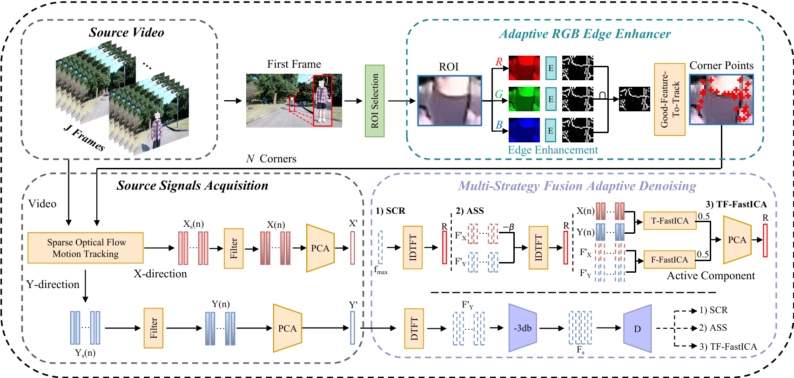

   <p align="center">
    <a href="https://scholar.google.com.hk/citations?user=1yhGS5sAAAAJ&hl=zh-CN"><strong>Gan Pei <sup>1</sup><sup>*</sup></strong></a>
    .
    <a href=""><strong>Junhao Ning<sup>1</sup></strong></a>
    .
    <a href=""><strong>Chenrui Niu<sup>1</sup></strong></a>
    .
    <a href=""><strong>Siqiong Yao<sup>2</sup><sup>#</sup></strong></a>
    .
    <a href="https://scholar.google.com.hk/citations?user=8-Vo9cUAAAAJ&hl=zh-CN"><strong>Menghan Hu<sup>1</sup><sup>#</sup></strong></a>
   . 
    <a href="https://scholar.google.com.hk/citations?user=E6zbSYgAAAAJ&hl=zh-CN"><strong>Guangtao Zhai<sup>2</sup></strong></a>
</p>
<p align="center">
    <strong><sup>1</sup>East China Normal University</strong> &nbsp;&nbsp;&nbsp; <strong><sup>2</sup>Shanghai Jiao Tong University</strong>
   <p align="center">
      <a href='https://ieeexplore.ieee.org/document/11458734'>
   <strong>TCSVT 2026</strong>
   
## ✨Abstract
For non-contact respiratory rate (RR) measurement, effectively addressing the interference from continuous motion artifacts remains a significant challenge. Most existing research focuses on the removal of weak motion artifacts in a two-dimensional plane, and the fixed spatial scale of the scenes limits the generalization of these methods to real-world scenarios, especially in real walking scenarios. To tackle this issue, we propose an RR measurement framework based on a multi-strategy fusion motion artifact suppression algorithm and have constructed a real-world walking dataset. Specifically, the framework consists of three core modules: an ROI automatic selection and adaptive enhancement module to guide the selection of high-quality corner points; a signal quality evaluation module that adaptively assesses whether the signal is noisy, preventing blind denoising; and a multi-strategy fusion motion artifact removal module that dynamically selects the appropriate strategy to suppress motion interference. To the best of our knowledge, this is the first study to investigate the task of video-based RR measurement in real walking scenarios. Experimental results demonstrate that the method achieves state-of-the-art performance across multiple datasets, with a mean absolute error (MAE) of **1.04 breaths per minute (bpm) on the COHFACE**, **3.17 bpm on the OVRM-Walking dataset**, and an average MAE of just **2.41 bpm on the in-house real-world walking dataset**, which includes both indoor and outdoor scenarios. This study broadens the applicability of camera-based non-contact RR detection technology.
   
## ✨Highlight
[1]  An adaptive edge enhancement module that integrates RGB three-channel features is proposed, enabling high-quality corner point selection in distant, low-light, and low-resolution ROI regions. 

[2]  A time-domain feature-based waveform quality assessment module is proposed, enabling on-demand activation of motion artifact removal to prevent performance degradation caused by excessive denoising.

[3]  A multi-strategy fusion-based adaptive noise removal method is proposed, which adaptively chooses SCR, ASS, and TF-FastICA denoising algorithms based on the signal’s spectral characteristics, effectively removing motion artifacts. To the best of our knowledge, this is the first study to investigate the task of video-based RR measurement in real walking scenarios. The proposed method exhibits superior performance compared to state-of-the-art (SOTA) methods on the in-house Walking Breathing dataset, OVRM-Walking dataset and COHFACE dataset.

[4]  A real-word walking dataset has been constructed, consisting of 600 video samples collected from both indoor and outdoor natural lighting environments, filling the gap of missing real-word walking datasets.


## ✨Pipeline
<p align="center">

 <p align="center">

## ✨In-house Walking Breathing Dataset
The dataset includes two scenes, indoor and outdoor, with 300 samples for each scene. For dataset requests, please contact the author via email.

## ✨Getting Started
### 1. Create an Environment
```bash
conda create -n Walking-Breath python=3.9
pip install numpy pandas scipy scikit-learn matplotlib tqdm opencv-python h5py
pip install torch torchvision
```
### 2. Dataset
The dataset should be organized in the following structure. Taking the COHFACE dataset as an example, it is recommended to obtain COHFACE from official sources.
```bash
./COHFACE/
    subject1/
        1.avi
        1.hdf5
        2.avi
        2.hdf5
        ...
    subject2/
        1.avi
        1.hdf5
        2.avi
        2.hdf5
        ...
    ...
```
### 3. Pre-trained HR-Net models


### 4. run the main.py

## Cite The Paper
If you find our research useful for your project, please consider citing our paper:

```bibtex
@article{pei2026video,
  author={Pei, Gan and Ning, Junhao and Niu, Chenrui and Yao, Siqiong and Hu, Menghan and Zhai, Guangtao},
  journal={IEEE Transactions on Circuits and Systems for Video Technology}, 
  title={Video Respiratory Rate Measurement in Walking Scenarios Using Multi-strategy Adaptive Denoising}, 
  year={2026},
  volume={Early Acess},
  doi={10.1109/TCSVT.2026.3679396}}
```

## Contact
```
52295904023@stu.ecnu.edu.cn
```
